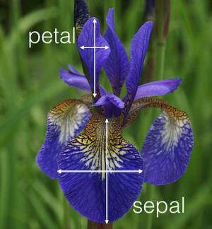

# Programming and Scripting - Project.

## Description.
This project concerns the well-known Fisher’s Iris data set. This project presents an excellent opportunity to learn and develop Python code skills. Researching the data set online and writing documentation about it in your README file is necessary. The task is divided into several smaller tasks, such as researching and summarizing the dataset, downloading and adding it to the repository, and writing a program to output summaries, histograms, and scatter plots for each variable. It is also expected to perform any other appropriate analysis. Extra documentation in the form of a Jupyter Notebook containing all your comments can be created. The data set, after a bit of searching, focused on finding well-formatted data, was downloaded from [Michael Waskom GitHub](https://github.com/mwaskom/seaborn-data/blob/master/iris.csv). It is very important to download the data set as Raw file. The file was chosen because it has the proper name: `iris.csv' and the data looks clear.
Below is a list of different sources of the Fisher’s Iris data set:

* [Jaeho Shin GitHub.](https://gist.github.com/netj/8836201)
* [Michael Waskom.](https://github.com/mwaskom/seaborn-data/blob/master/iris.csv)
* [Open Course Ware website.](https://ocw.mit.edu/courses/15-097-prediction-machine-learning-and-statistics-spring-2012/89d88c5528513adc4002a1618ce2efb0_iris.csv)
* [UC Irvine Machine Learning Repository.](https://archive.ics.uci.edu/dataset/53/iris)


## Reseach the data set.
While searching the Internet for information about the Iris dataset and the source of the csv file representing this dataset, it was visible that it is a very popular source for analysis.
This data set is widely analyzed by analysts on many websites, highlighting its value as a source of highly valuable information.
Summary:
Accoding to [Wikipedia website](https://en.wikipedia.org/wiki/Iris_flower_data_set):
The Iris flower data set, known as Fisher's Iris data set, is a multivariate data set used by British statistician and biologist Ronald Fisher. This is a perfect example of linear discriminant analysis. The data set includes 50 samples of each of the three species of Iris flowers called setosa, virginica and versicolor, and four features such as sepal length, sepal width, petal length and petal width were measured from each sample. By combining these four features, Fisher developed a linear discriminant model which could discriminate between species. The Iris data set is famous as a starting point for machine learning and comes with both R base and Python in the scikit-learn machine learning library.



The picture illustrates what is the sepal length, sepal width, petal length and petal width. It was originally updated by Pratibha Jadhav on the [ResearchGate website](https://www.researchgate.net/figure/Description-of-IRIS-dataset-showing-Petal-length-Sepal-length-Petal-width-and-Sepal_fig1_342859543) and may be subject to copyright.

The repository has the following structure:
* Folder [`data`](data) - The folder where the data file is located is iris.csv
* Folder [`img`](img) - The forlder where pictures are located.
* [`.gitignore`](.gitignore) - The file where can define files or folders that Git should ignore and not track in a repository.
* [`analysis.py`](analysis.py) - The main program for this project.
* [`analysisFunctions.py`](analysisFunctions.py) - The file where are located all functions used to perform the analysis.
* [`Documentation.ipynb`](Documentation.ipynb) - The is a well-organized guidebook that explains implemented algorithms and techniques. It's a must-have for users seeking to understand codes and academic information. 
* [`plottingFunctions.py`](plottingFunctions.py) - The file where all functions used to perform plotting and short functions with simplified calling of the plotting functions in the main program are located.
* [`README.md`](README.md) - The file where every user should start their experience with the repository. It contains essential information and guidance through the repository.


## Getting Started.

If you want to be sure that you have the right programming environment for this repository, you should follow these extra 
steps:

1. Install Anaconda: 
    - Download the Anaconda distribution for your operating system from the official Anaconda website: https://www.anaconda.com/products/individual
    - Follow the installation instructions provided on the website. 
      During instalation MAKE SURE you check the two check boxes
       * Add to PATH variable
       * Make this version your default Python


   

2. Install Git:
    - Download Git for your operating system from the official Git website: https://git-scm.com/downloads
    - Follow the installation instructions provided on the website.

3. Install Visual Studio Code (VS Code):
    - Download Visual Studio Code for your operating system from the official VS Code website: https://code.visualstudio.com/download
    - Follow the installation instructions provided on the website.

4. Configure Git:
    - Open a terminal or Git Bash.
    - Set your name and email address using the following commands:
      ```
      git config --global user.name "Your Name"
      git config --global user.email "your.email@example.com"
      ```

5. Clone the repository to your local machine using the following command:
    ```
    git clone https://github.com/TomUszyn/pands-project.git
    ```

6. Navigate to the cloned repository:
    ```
    cd pands-project

7. In VS Code, type name of file [`analysis.py`](analysis.py) from the pands-project folder and press enter to execute it.

Notice: Make sure you are in the correct patch for the file you are trying to execute. Otherwise, you may encounter an error.

## Manual.

To start using program type analysis.py and press enter. It will launch the main program, welcome message and a menu will appear with the following options:
* (s) Create the summary file for the Iris dataset. This option generates a text file summarizing the dataset.
* (h) Create histograms for each variable in the Iris dataset and save it to PNG files. This option creates histograms for individual variables and saves them as PNG files.
* (p) Create scatter and plots for each pair of variables in the Iris dataset. This option generates and displays scatter plots for various pairs of data.
* (a) Perform advanced analysis for the Iris dataset to the txt file. This option conducts the following analyses and saves it to the analysis.txt file:
    - Correlation analysis.
    - Mean, median, and standard deviation calculations for each species.
    - Identification of outliers for each species.
* (q) Quit. This option quits the program.

The user chooses an option by typing the related letter and pressing enter. The program provides information about what is going on and guides the user through what to do.

Important notice: Users should note that scatter plots are not generated simultaneously. To display another scatter plot, the currently displayed one must be closed.

If an option other than 'q' is selected, the associated actions are executed, and then a menu is displayed for reselection. Choosing 'q' only results in program exit. 
The user can find all generated files in the same folder where the analysis.py is located.

## License.

This repository is licensed under the MIT License. See below:


Copyright (c) 2024 <copyright holder Tomasz Uszynski>

Permission is hereby granted, free of charge, to any person obtaining a copy
of this software and associated documentation files (the "Software"), to deal
in the Software without restriction, including without limitation the rights
to use, copy, modify, merge, publish, distribute, sublicense, and/or sell
copies of the Software, and to permit persons to whom the Software is
furnished to do so, subject to the following conditions:

The above copyright notice and this permission notice shall be included in all
copies or substantial portions of the Software.

THE SOFTWARE IS PROVIDED "AS IS", WITHOUT WARRANTY OF ANY KIND, EXPRESS OR
IMPLIED, INCLUDING BUT NOT LIMITED TO THE WARRANTIES OF MERCHANTABILITY,
FITNESS FOR A PARTICULAR PURPOSE AND NONINFRINGEMENT. IN NO EVENT SHALL THE
AUTHORS OR COPYRIGHT HOLDERS BE LIABLE FOR ANY CLAIM, DAMAGES OR OTHER
LIABILITY, WHETHER IN AN ACTION OF CONTRACT, TORT OR OTHERWISE, ARISING FROM,
OUT OF OR IN CONNECTION WITH THE SOFTWARE OR THE USE OR OTHER DEALINGS IN THE
SOFTWARE.

## Contact.

If you have any questions or suggestions, feel free to reach out to me at [tomaszuszynski3@gmail.com](mailto:tomaszuszynski@gmail.com).

## Author.

As a novice in the world of programming, I am deeply passionate about this field and eager to explore new concepts and technologies. Programming provides me with a platform to showcase my creativity and problem-solving abilities, fueling my enthusiasm to improve my programming skills. With programming, I can delve into data analysis, work with datasets, identify important findings, and make data-driven decisions. It equips me with the necessary tools and skills to explore intricate data sets, apply statistical techniques, and visualize data effectively. Programming offers a plethora of opportunities in data analysis, enabling me to contribute to solving real-world issues. Programming drives me to work diligently in my everyday routine and helps me translate ideas into real-life applications. It is a stimulating and rewarding field with countless possibilities for personal and professional growth.

Best regards,

Tomasz Uszynski